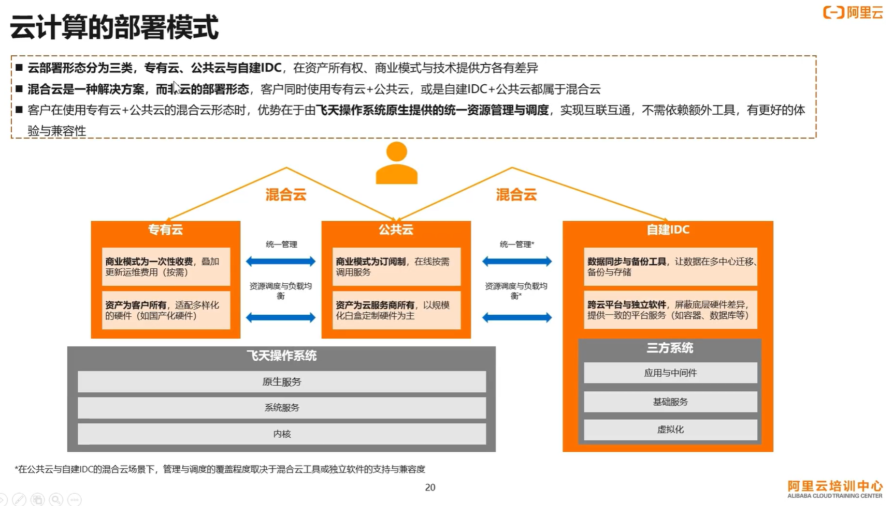

阿里云云计算工程师 ACP 认证  

官网链接：[阿里云云计算工程师ACP认证](https://edu.aliyun.com/certification/acp01)  
学习视频：[阿里云云计算高级工程师ACP认证](https://edu.aliyun.com/certification/acp01)  
  
  
# 数据中心  
在计算机领域，数据中心（Data Center）是一个专门设计和建设的设施，用于集中存储、管理和处理大量的计算机数据、应用程序和服务。  
  
数据中心通常包括以下主要组成部分：  
  
1. 服务器和存储设备：数据中心内部有大量的服务器和存储设备，用于承载和存储各种应用程序、数据库和文件数据。这些服务器通常以机架式布局（Rack-mounted）进行安装，通过网络互联。  
  
2. 网络设备：数据中心内部配备了高性能的网络设备，如路由器、交换机、负载均衡器等，用于连接和管理数据中心内的服务器和外部网络之间的数据通信。  
  
3. 冷却和电力设备：数据中心需要强大的冷却系统来保持服务器和设备的温度在适宜范围内，以防止过热。此外，数据中心还需要大容量的电力供应和备用发电设备，以确保运行的稳定性和可靠性。  
  
4. 安全设施：数据中心需要严格的物理安全措施，如访问控制系统、监控摄像头、入侵检测系统等，以保护数据中心的设备和数据免受未经授权的访问和物理风险。  
  
5. 管理和监控系统：数据中心配备了管理和监控系统，用于追踪和管理服务器和设备的状态、性能和资源利用情况，以及进行故障检测和远程管理。  
  
数据中心在计算机领域扮演着关键的角色，它是支持大规模计算、数据存储和网络服务的基础设施。数据中心通常由大型企业、云服务提供商、托管服务提供商等组织运营和管理，为用户提供高可用性、可靠性和安全性的计算和存储能力。  
  
# 云计算的背景与发展  
  
## 企业数据中心 EDC  
- Enterprise Data Center  
- 企业自建，自己运维，稳定性要求高，上线时间长，运营成本高，扩展灵活性低  
- 数据中心分为 L0~L4 五层  
  
  
  
## 互联网数据中心 IDC  
- Internet Data Center  
- 有服务器托管和服务器租用两种方式  
  
  
  
# 基础设施  
在计算机领域，基础设施（Infrastructure）指的是支持和维护计算机系统运行所需的硬件、软件和网络资源。它是构建和运行计算机系统的基本框架和基础设备。  
  
计算机基础设施包括以下方面：  
  
1. 硬件基础设施：包括计算机服务器、存储设备、网络设备、机架和机柜等物理设备，用于支持计算、存储和通信等功能。  
  
2. 软件基础设施：包括操作系统、数据库管理系统、中间件、编程语言和开发工具等软件，用于管理和控制计算机系统的运行。  
  
3. 网络基础设施：包括局域网（LAN）、广域网（WAN）、路由器、交换机、防火墙等网络设备，用于连接和通信计算机系统和设备之间的数据传输。  
  
4. 数据中心基础设施：包括服务器机房、冷却设备、供电设备、备份系统和监控系统等，用于支持大规模计算和数据存储的设施。  
  
5. 安全基础设施：包括防病毒软件、防火墙、入侵检测系统（IDS）、身份验证和访问控制等安全机制，用于保护计算机系统和数据的安全性。  
  
计算机基础设施为应用程序、服务和用户提供了必要的资源和环境，支持计算机系统的正常运行和使用。它是构建和运营各种计算机应用和服务的基础，包括云计算、网络服务、数据库管理、软件开发等。  
  
  
数据中心和基础设施的区别：  
数据中心（Data Center）是一个专门设计和建设的设施，用于集中存储、管理和处理大量的计算机数据、应用程序和服务。数据中心是一个实体，包含了服务器、存储设备、网络设备、冷却和电力设备、安全设施等，用于支持大规模的计算和存储能力。数据中心提供高可用性、可靠性和安全性的计算和存储资源，为各种应用和服务提供支持。  
  
基础设施（Infrastructure）是一个更广泛的概念，指的是支持和维护计算机系统运行所需的硬件、软件和网络资源。基础设施包括物理基础设施和软件基础设施。物理基础设施包括计算机服务器、存储设备、网络设备、机架和机柜等物理设备。软件基础设施包括操作系统、数据库管理系统、中间件、编程语言和开发工具等软件。基础设施提供了计算机系统运行所需的基本框架和基础资源。  
  
因此，数据中心是基础设施的一部分，它是基础设施的一个具体实现和集中化的形式。数据中心提供了更高级别的计算和存储资源，而基础设施则是广义上支持整个计算机系统运行的基本组成部分。数据中心可以被视为基础设施的一种特殊类型，专门用于大规模的数据存储和处理。  
  
# 网站流量相关指标  
  
## PV  
PV（Page Views）是指网站页面的浏览量或访问量。它表示网站上所有页面被访问的总次数。PV是衡量网站流量和受欢迎程度的重要指标之一。  
  
PV是通过统计网站服务器接收到的页面请求次数来计算的。每当用户打开一个网页，都会发送一个请求到服务器，服务器接收到请求后会记录一次PV。如果用户在同一个页面刷新或重复访问，也会被计算为多次PV。  
  
PV可以用来评估网站的访问量、用户活跃度和页面的受欢迎程度。较高的PV表示网站受到更多的访问和浏览，而较低的PV可能意味着网站流量较少或页面内容不够吸引人。  
  
## UV   
网站UV（Unique Visitors）是指网站的独立访客数量，它表示不同的用户访问网站的数量，不论这些用户访问了多少次或浏览了多少页面。UV是一个用于衡量网站受众规模和用户活跃度的重要指标。  
  
UV通过识别访问网站的用户的唯一标识（如IP地址、浏览器Cookie等）来计算。当同一个用户在一定时间范围内访问网站时，只计算为一个UV。如果同一个用户在不同时间访问网站，会被计算为多个UV。  
  
UV指标可以帮助网站了解自己的受众规模和用户数量。它可以用于评估网站的用户增长趋势、用户留存率以及用户行为分析。通过分析UV数据，网站可以了解自己的用户群体特征、用户喜好和行为习惯，从而进行更有针对性的运营和营销策略。  
  
需要注意的是，UV是相对于PV（Page Views）来衡量网站访问量的。PV表示页面浏览量或访问次数，而UV表示不重复访问网站的用户数量。因此，UV通常会低于PV，因为一个用户可能会在一次访问中浏览多个页面，从而增加PV，但只计算为一个UV。  
  
## IP  
IP（Internet Protocol，独立IP数）指标表示不同IP地址访问网站的数量。与UV类似，IP也用于估计网站的独立访问者数量。  
  
# 上行流量和下行流量  
上行流量和下行流量是用于描述网络数据传输方向的术语。  
  
上行流量（Upstream Traffic）指的是从用户设备或本地网络发送到远程服务器或网络的数据流量。它表示用户或设备向网络上传输数据的量。例如，当你发送电子邮件、上传文件或发布内容时，产生的数据流量就是上行流量。  
  
下行流量（Downstream Traffic）指的是从远程服务器或网络传输到用户设备或本地网络的数据流量。它表示网络向用户或设备下载数据的量。例如，当你浏览网页、观看在线视频或下载文件时，产生的数据流量就是下行流量。  
  
上行流量和下行流量在互联网通信中起着重要的作用。通常，上行流量和下行流量的速率可能不对称，因为大多数常见的互联网应用场景中，用户通常需要下载更多的数据，而上传的数据量相对较少。例如，当你通过视频流观看在线视频时，下行流量较大，而上传视频或其他用户生成内容的上行流量较小。  
  
网络服务提供商（ISP）通常根据上行流量和下行流量的使用情况来制定不同的网络服务套餐和计费策略。一些特定应用场景，如视频会议、云存储、远程办公等，可能需要更高的上行流量，而其他场景，如媒体传输、下载等，可能更注重下行流量。  
  
  
# 云计算  
- 基于互联网的计算方式，通过这种方式，共享的软硬件资源和信息可以按需提供给计算机和其他设备  
  
  
  
  
  
# IaaS Paas SaaS 三种服务模式  
  
  
  
  
# 专有云 公用云 自建IDC 三种部署模式  
  
  
  
  
# 云服务器 ECS  
> [什么是云服务器ECS](https://help.aliyun.com/zh/ecs/product-overview/what-is-ecs)  
  
## 使用限制  
> [使用限制](https://help.aliyun.com/zh/ecs/product-overview/limits?spm=a2c4g.11186623.0.0.233d300cDFPXED)  
  
- 支持直接加载外接硬件设备（如硬件加密狗、U盘、外接硬盘、银行UKey等），您可以尝试软件加密狗或者动态口令二次验证等。  
- 不支持多播协议。如果需要使用多播，建议改为使用单播点对点方式。  
  
## 安全组  
> [安全组](https://help.aliyun.com/zh/ecs/user-guide/security-groups-1/?spm=a2c4g.11186623.0.0.409d7711ZsGNGG)  
  
## 实例的生命周期  
> [实例的生命周期](https://help.aliyun.com/zh/ecs/user-guide/instance-lifecycle?spm=a2c4g.11186623.0.i11#concept-zg1-gv2-5db)  
  
## 实例规格族  
> [实例规格族](https://help.aliyun.com/zh/ecs/user-guide/overview-of-instance-families)  
  
实例是能够为您的业务提供计算服务的最小单位，不同的实例规格可以提供的计算能力不同。  
  
ECS实例规格定义了实例的基本属性：CPU和内存（包括CPU型号、主频等）。但是，ECS实例只有同时配合块存储、镜像和网络类型，才能唯一确定一台实例的具体服务形态。  
  
## 创建快照  
> [创建一个云盘快照](https://help.aliyun.com/zh/ecs/user-guide/create-a-snapshot-of-a-disk?spm=a2c4g.11186623.0.i21#concept-eps-gbl-xdb)  
  
## 弹性裸金属服务器  
> [弹性裸金属服务器](https://help.aliyun.com/zh/ecs/user-guide/overview-49)  
  
弹性裸金属服务器（ECS Bare Metal Instance）是基于阿里云完全自主研发的下一代虚拟化技术而打造的新型计算类服务器产品，兼具虚拟机的弹性和物理机的性能及功能特性。与上一代虚拟化技术相比，下一代虚拟化技术不仅保留了普通云服务器的弹性体验，而且保留了物理机的性能与特性，全面支持嵌套虚拟化技术。  
  
- 用户独占计算资源  
- 加密计算兼容多种专有云  
- 兼容多种专有云  
- 异构指令集处理器支持  
  
## ECS实例从经典网络迁移到专有网络  
> [ECS实例从经典网络迁移到专有网络](https://help.aliyun.com/zh/ecs/user-guide/migrate-ecs-instances-from-the-classic-network-to-a-vpc)  
  
  
  
# 专有网络 VPC  
> [什么是专有网络](https://help.aliyun.com/document_detail/34217.html)  
  
- 基于目前主流的隧道技术，专有网络隔离了虚拟网络。每个VPC都有一个独立的隧道号，一个隧道号对应着一个虚拟化网络。  
- 基于隧道技术和软件定义网络SDN（Software Defined Network）技术，阿里云在硬件网关和自研交换机设备的基础上推出了VPC产品。  
- 专有网络地域级别资源，不能跨地域  
- 一个地域中每个可用区中创建一个或多个交换机来划分子网  
- 每个交换机只能关联一张路由表  
  
## VPC 访问配置  
> [访问控制](https://help.aliyun.com/zh/vpc/user-guide/access-control/?spm=a2c4g.11186623.0.0.565724cbHQMGMQ)  
  
### 网络 ACL  
> [网络 ACL](https://help.aliyun.com/zh/vpc/user-guide/network-acl/?spm=a2c4g.11186623.0.0.4df07220KJ4FJy)  
  
- 网络ACL的规则是无状态的，即设置入方向规则的允许请求后，需要同时设置相应的出方向规则，否则可能会导致请求无法响应。  
- 网络ACL无任何规则时，会拒绝所有出入方向的访问。  
- 网络ACL无任何规则时，会拒绝所有出入方向的访问。  
  
### 安全组  
  
### 网络 ACL 与安全组  
> [网络ACL与安全组](https://help.aliyun.com/zh/vpc/user-guide/overview-7#section-wnz-of7-jf4)  
  
## 交换机管理  
> [创建和管理交换机](https://help.aliyun.com/zh/vpc/user-guide/create-and-manage-vswitch?spm=a2c4g.11186623.0.0.262e5f15QfxJLz)  
  
- 每个交换机的第1个和最后3个IP地址为系统保留地址  
- 每个交换机只能关联一张路由表  
  
## IPv4 网关  
> [IPv4网关概述](https://help.aliyun.com/zh/vpc/user-guide/ipv4-gateway-overview)  
  
## 网络连接  
> [网络连接](https://help.aliyun.com/zh/vpc/user-guide/network-connection/?spm=a2c4g.11186623.0.0.3c3f665eMCMNq8)  
  
### 跨 VPC 互联  
> [跨VPC互联概述](https://help.aliyun.com/zh/vpc/user-guide/cross-vpc-interconnection-overview?spm=a2c4g.11186623.0.i29)  
  
#### VPC 对等连接  
- 可以通过VPC对等连接，实现两个同账号或跨账号VPC间同地域或跨地域的私网互通。  
  
## 使用高可用虚拟IP（HaVip）  
> [使用高可用虚拟IP（HaVip）](https://help.aliyun.com/zh/vpc/user-guide/use-highly-available-virtual-ip)  
  
HaVip是一种可以独立创建和释放的私网IP资源，具备与ECS实例主私网IP地址一样的网络接入能力，可以与高可用软件，例如Keepalived配合使用，搭建高可用主备服务，提高业务的可用性。  
  
HaVip支持绑定一个弹性公网IP（EIP）、多个ECS实例或多个ECS实例的主网卡或辅助网卡，以实现同可用区、多服务器高可用架构下的IP漂移，确保对外提供服务的私网IP始终不变。此外，该架构下的多个ECS实例还可以利用部署集能力进一步提升业务的可靠性，更多信息，请参见部署集概述。  
  
## 限制不同交换机下的ECS间的互通  
> [限制不同交换机下的ECS间的互通](https://www.alibabacloud.com/help/zh/vpc/user-guide/manage-intercommunication-among-ecs-instances-connected-to-different-vswitches)  
  
  
  
# 弹性公网IP EIP  
> [什么是弹性公网 IP](https://help.aliyun.com/document_detail/32321.html)  
  
# NAT 网关  
> [什么是NAT网关](https://help.aliyun.com/zh/nat-gateway/product-overview/what-is-nat-gateway?spm=a2c4g.11186623.0.0.165f6c75S15aRX)  
  
- 一个VPC支持创建的公网NAT网关的数量为 5  
- 一个公网NAT网关支持绑定EIP的数量为 20  
  
  
## 公网 NAT 网关  
> [什么是公网NAT网关](https://help.aliyun.com/zh/nat-gateway/user-guide/enhanced-nat-gateways?spm=a2c4g.11174283.0.0.1500371fKhoSmb)  
  
# 全球加速 GA  
> [什么是全球加速](https://help.aliyun.com/document_detail/153189.html)  
  
# 云企业网 CEN  
> [什么是云企业网](https://help.aliyun.com/zh/cen/product-overview/what-is-cen)  
  
## 云企业网和高速通道的区别  
> [云企业网与高速通道有什么区别？](https://help.aliyun.com/zh/cen/support/faq-1#section-9ek-asp-2ne)  
  
# 转发路由器 TR  
> [转发路由器工作原理](https://help.aliyun.com/zh/cen/product-overview/how-transit-routers-work)  
  
# 边界路由器 VBR  
> [什么是边界路由器](https://help.aliyun.com/zh/express-connect/user-guide/what-is-a-virtual-border-router)  
  
# 云连接网 CCN  
> [云连接网介绍](https://help.aliyun.com/zh/sag/user-guide/introduction-to-ccn)  
  
# Overlay Network  
> [Overlay Network](https://info.support.huawei.com/info-finder/encyclopedia/en/Overlay+network.html)  
  
# 万物上云组件  
  
  
## 智能接入网关 SAG  
> [什么是智能接入网关](https://help.aliyun.com/zh/sag/product-overview/what-is-sag)  
  
- 硬件CPE（Customer Premises Equipment）设备形态：适用于站点接入上云。  
- 镜像vCPE形态：适用于站点接入上云。  
- App形态：适用于终端接入上云。  
  
## 云连接器 CC  
> [什么是云连接器](https://help.aliyun.com/zh/cloud-connector/product-overview/what-is-cloud-connector)  
  
云连接器（Cloud Connector）提供海量物联网卡一站式定向上云连接服务，即开即用，帮您实现物联网终端到阿里云之间安全、稳定、可靠的连接。  
  
云连接器通过专用APN在物联网终端和阿里云之间建立定向网络连接。您也可以通过云上组网，实现物联网终端到物联网应用或本地数据中心IDC（Internet Data Center）的定向连接。  
  
## VPN 网关  
> [什么是VPN网关](https://help.aliyun.com/zh/vpn/product-overview/what-is-vpn-gateway)  
  
- IPsec-VPN  
IPsec-VPN是一种基于路由的网络连接技术，提供灵活的流量路由方式，方便您配置和维护VPN策略，适用于在企业本地数据中心或企业办公网络与VPC之间建立网络连接。  
    - 绑定VPN网关  
    - 绑定转发路由器  
    在您创建IPsec-VPN时，您无需购买VPN网关实例，也无需关联VPC，您需要使用云企业网CEN（Cloud Enterprise Network）产品，在云企业网下创建转发路由器实例。  
  
- [SSL-VPN](https://help.aliyun.com/zh/vpn/user-guide/overview-of-ssl-vpn-configurations?spm=a2c4g.11186623.0.i82)  
SSL-VPN是一种基于OpenVPN架构的网络连接技术，适用于在互联网客户端与VPC之间建立网络连接。部署后，仅需要在互联网客户端中加载证书并发起连接，互联网客户端便可与VPC互通。  
  
## 高速通道  
> [什么是高速通道](https://help.aliyun.com/zh/express-connect/product-overview/what-is-express-connect)  
  
# 资源编排 ROS  
> [什么是资源编排服务](https://help.aliyun.com/document_detail/28852.html?spm=a2c4g.28850.0.0.3cdb1190uUAcGP)  
  
# 服务器迁移中心 SMC  
> [什么是服务器迁移中心](https://help.aliyun.com/zh/smc/product-overview/what-is-smc?spm=a2c4g.11174283.0.0.7cc51dc3y5sj0V)  
  
# 文件存储 NAS  
> [什么是文件存储NAS](https://help.aliyun.com/zh/nas/product-overview/what-is-nas?spm=a2c4g.11186623.0.0.47d76a54xg8imS)  
  
## 产品规格  
> [产品规格](https://help.aliyun.com/zh/nas/product-overview/how-do-i-select-file-systems?spm=a2c4g.11186623.0.i60)  
  
  
# 文件存储 HDFS 版  
> [什么是文件存储 HDFS 版](https://help.aliyun.com/document_detail/87473.html?spm=a2c4g.87442.0.0.354a73ecqHZhMe)  
   
  
# 文件存储 CPFS  
> [什么是文件存储CPFS](https://help.aliyun.com/document_detail/111755.html?spm=a2c4g.111536.0.0.6be56c75syVioD)  
  
  
# 对象存储 OSS   
> [什么是对象存储OSS](https://help.aliyun.com/zh/oss/product-overview/what-is-oss?spm=a2c4g.11174283.0.0.8f076987EcUKFU)    
> [对象概述](https://help.aliyun.com/zh/oss/user-guide/overview-18?spm=a2c4g.11186623.0.0.3dbc58afO7rqtt)    
  
对象存储是一种存储架构，用于存储和管理大规模数据的分布式存储系统    
与传统的文件系统或块存储不同，对象存储将数据组织为对象（Object），并为每个对象分配唯一的标识符（ID）    
每个对象包含数据本身以及与其关联的元数据（如对象的名称、大小、创建时间等）    
  
## 存储空间  
> [创建存储空间](https://help.aliyun.com/zh/oss/user-guide/create-a-bucket-4?spm=a2c4g.11186623.0.i80)  
  
- 同一阿里云账号在同一地域内创建的存储空间总数不能超过100个。  
- 存储空间创建后，其名称、所处地域、存储类型不支持修改。  
- 单个存储空间的容量不限制。  
  
## 权限控制  
> [权限控制](https://help.aliyun.com/zh/oss/user-guide/access-and-control/?spm=a2c4g.11186623.0.0.278134abFntk8E)  
  
- Object ACL 权限优先级高于 buket ACL  
  
## 使用文件 URL  
> [使用文件URL分享文件](https://help.aliyun.com/zh/oss/user-guide/how-to-obtain-the-url-of-a-single-object-or-the-urls-of-multiple-objects?spm=a2c4g.11186623.0.i54)  
  
## 版本控制  
> [版本控制](https://help.aliyun.com/zh/oss/user-guide/overview-78?spm=a2c4g.11186623.0.i39)  
  
## 存储冗余  
> [存储冗余概述](https://help.aliyun.com/zh/oss/user-guide/overview-of-storage-redundancy-types?spm=a2c4g.11186623.0.0.6c4a6856Mj9D80)  
  
### 本地冗余存储  
  
### 同城冗余存储  
同城冗余存储能够提供机房级容灾能力。当发生断网、断电或者灾难事件导致某个机房不可用时，OSS仍能继续提供强一致性的服务。整个故障切换过程用户无感知、业务不中断、数据不丢失，满足关键业务系统对于恢复时间目标（RTO）以及恢复点目标（RPO）等于0的强需求。  
  
## 加速管理  
> [加速管理](https://help.aliyun.com/zh/oss/user-guide/accelerated-management-overview?spm=a2c4g.11186623.0.i31)  
  
### 传输加速  
  
  
## Object 操作  
### PutObject  
> [PutObject](https://help.aliyun.c/om/zh/oss/developer-reference/putobject?spm=a2c4g.11186623.0.i57)  
  
## 使用 ECS 实例反向代理 OSS  
> [使用ECS实例反向代理OSS](https://help.aliyun.com/zh/oss/use-cases/use-ecs-instances-to-configure-a-reverse-proxy-for-access-to-oss/?spm=a2c4g.11186623.0.0.a6d2516523kt69)  
  
## 数据处理  
  
### 图片处理  
> [图片处理](https://help.aliyun.com/zh/oss/user-guide/overview-17?spm=a2c4g.11186623.0.i10)  
  
## 命令行工具 ossutil  
> [命令行选项](https://help.aliyun.com/zh/oss/developer-reference/configure-ossutil?spm=a2c4g.11186623.0.0.606a70b45rKgrx)  
  
## 客户端直传概述  
> [客户端直传概述](https://help.aliyun.com/zh/oss/use-cases/client-direct-transmission-overview)  
  
客户端直传是指客户端直接上传文件到对象存储OSS。相对于服务端代理上传，客户端直传避免了业务服务器中转文件，提高了上传速度，节省了服务器资源。  
  
# 块存储 EBS  
  
  
## 专属块存储集群  
> [专属块存储集群](https://help.aliyun.com/zh/ecs/user-guide/overview-31?spm=a2c4g.11186623.0.i1)  
  
专属块存储集群（Dedicated Block Storage Cluster）是阿里云提供的一种以集群为整体的块存储服务，具备物理资源隔离、集群内资源独享的特点。使用专属块存储集群，您可以提升业务数据存储的安全性及运维效率。  
  
- 基础型专属块存储集群  
主要用于一般的数据存储场景，例如文件共享、备份和恢复等。它通常具有基本的数据冗余和备份功能，可以提供可靠的数据保护和恢复能力。基础型专属块存储集群的存储性能较为适中，适合处理一般负载的应用场景。  
- 性能型专属块存储集群  
主要用于需要高性能的数据存储场景，例如数据库、虚拟化和云计算等。它通常具有更高的存储性能和更复杂的数据保护机制，可以提供更快速、更可靠的数据访问和运算能力。性能型专属块存储集群通常支持高速网络连接和数据缓存技术，能够处理高负载和复杂的任务场景。  
  
## 本地盘  
> [本地盘](https://help.aliyun.com/zh/ecs/user-guide/local-disks?spm=a2c4g.11186623.0.0.76027d41zga7AK)  
  
本地盘是ECS实例所在物理机上的本地硬盘设备。本地盘能够为ECS实例提供本地存储访问能力，具有低时延、高随机IOPS、高吞吐量和高性价比的优势。  
  
## 回源  
> [回源](https://help.aliyun.com/zh/oss/user-guide/overview-73?spm=a2c4g.11186623.0.0.dba83e90UOVHti)  
  
当请求者向您的对象存储OSS请求的数据不存在时，本应返回404错误。如果您设置了回源规则，填写了数据的正确地址，请求者即可通过回源规则从OSS获取到正确的数据。回源分为镜像回源和重定向两种，可以满足您对于数据热迁移、特定请求的重定向等需求。  
  
  
# 快照  
> [快照概述](https://help.aliyun.com/zh/ecs/user-guide/snapshot-overview?spm=a2c4g.465764.0.i2#concept-qft-2zw-ydb)  
  
## 自动快照  
> [自动快照](https://help.aliyun.com/zh/ecs/user-guide/overview#concept-1443642)  
  
# 日志服务 SLS    
> [什么是日志服务](https://help.aliyun.com/zh/sls/product-overview/what-is-log-service?spm=a2c4g.11174283.0.0.4b7f35aePlRBAv)  
  
## Logtail采集  
> [Logtail采集概述](https://help.aliyun.com/zh/sls/user-guide/use-logtail-to-collect-data?spm=a2c4g.11186623.0.i4)  
  
Logtail是日志服务提供的日志采集Agent，用于采集阿里云ECS、自建IDC、其他云厂商等服务器上的日志。  
  
## 管理Logstore  
> [管理Logstore](https://help.aliyun.com/zh/sls/user-guide/manage-a-logstore?spm=a2c4g.11186623.0.i3#concept-xkb-zh5-vdb)  
  
日志库（Logstore）是日志服务中日志数据的采集、存储和查询单元。每个Logstore隶属于一个Project，每个Project中可创建多个Logstore。  
  
- 标准型Logstore：支持日志服务一站式数据分析功能，适用于实时监控、交互式分析以及构建完整的可观测性系统等场景。  
- 查询型Logstore：支持高性能查询，索引流量费用低于Standard，但不支持SQL分析，适用于数据量大、存储周期长（周、月级别以上）、无日志分析的场景。  
  
## 数据加工  
> [数据加工](https://help.aliyun.com/zh/sls/user-guide/data-transformation-overview?spm=a2c4g.11186623.0.0.389a59afJJ4uG7)  
  
1. 通过协同消费组对源Logstore的数据进行读取。  
2. 通过加工规则对读取到的每一条数据进行加工处理。  
3. 将加工后的数据写入目标Logstore。  
数据加工完成后，您可以在目标Logstore中查看加工后的数据。  
  
# 云关系型数据库 RDS  
> [云数据库RDS简介](https://help.aliyun.com/zh/rds/what-is-apsaradb-rds?spm=a2c4g.11174283.0.0.e70b753eINwuE1)  
  
## 产品系列  
> [产品系列概述](https://help.aliyun.com/zh/rds/product-overview/overview-11?spm=a2c4g.11186623.0.i5#mysql)  
  
- 基础系列  
- 高可用系列  
一主一备的高可用架构，支持自动故障切换。备实例不可访问。  
支持增加只读实例扩展读能力。  
基于性能考虑，高可用系列实例的主备节点不可以跨地域。  
- 集群系列  
- 三节点企业版  
一主一备一日志  
适合安全性要求高的企业  
  
## RDS 规格族  
> [实例规格族](https://help.aliyun.com/zh/rds/instance-families?spm=a2c4g.11186623.0.i40)  
  
## 存储类型  
> [存储类型](https://help.aliyun.com/zh/rds/product-overview/storage-types?spm=a2c4g.11186623.0.0.16782d870YJ8q9)  
  
## 创建异地灾备实例  
> [创建异地灾备实例](https://help.aliyun.com/zh/rds/apsaradb-rds-for-mysql/create-a-disaster-recovery-apsaradb-rds-for-mysql-instance?spm=a2c4g.11186623.0.i4#concept-bpb-gw5-vdb)  
  
对于数据可靠性有强需求的业务场景或是有监管需求的金融业务场景，RDS MySQL提供异地灾备实例，帮助用户提升数据可靠性。  
  
# 数据管理 DMS  
> [什么是数据管理DMS](https://help.aliyun.com/zh/dms/product-overview/what-is-dms?spm=a2c4g.11174283.0.0.7d193b4aZy2678)  
  
# 数据传输服务 DTS  
> [什么是数据传输服务DTS](https://help.aliyun.com/zh/dts/product-overview/what-is-dts?spm=a2c4g.11174283.0.0.28fb3f53VVmISR)  
  
# 数据库自治服务DAS  
> [数据库自治服务DAS](https://help.aliyun.com/zh/das/product-overview/what-is-das?spm=a2c4g.11174283.0.0.64d348d7kcPNDZ)  
  
数据库自治服务DAS（Database Autonomy Service）是一种基于机器学习和专家经验实现数据库自感知、自修复、自优化、自运维及自安全的云服务，帮助用户消除数据库管理的复杂性及人工操作引发的服务故障，有效保障数据库服务的稳定、安全及高效。  
  
# 负载均衡 SLB  
> [负载均衡](https://help.aliyun.com/zh/slb?spm=a2c4g.11186623.0.i15)  
  
  
  
- DNS 负载均衡  
- 二次负载均衡  
- 三次负载均衡  
- 四次负载均衡  
- 七层负载均衡  
  
  
  
  
禁用公网网卡对负载均衡服务的影响：[禁用公网网卡是否影响负载均衡服务？](https://help.aliyun.com/zh/slb/classic-load-balancer/user-guide/faq-about-clb?spm=a2c4g.11186623.0.i9)  
  
  
  
## 负载均衡算法  
- 静态算法  
- 动态算法  
  
## 性能指标  
### 最大连接数  
- Max Connection  
- 最大连接数定义了一个负载均衡实例能够承载的最大连接数量。当实例上的连接超过规格定义的最大连接数时，新建连接请求将被丢弃。  
  
### 每秒新建连接数 Connection Per Second（CPS）  
每秒新建连接数定义了新建连接的速率。当新建连接的速率超过规格定义的每秒新建连接数时，新建连接请求将被丢弃。  
  
### 每秒查询数-Query Per Second（QPS）  
每秒请求数是七层监听特有的概念，指的是每秒可以完成的HTTP或HTTPS的查询（请求）的数量。当请求速率超过规格所定义的每秒查询数时，新建连接请求将被丢弃。  
  
## 使用负载均衡SLB后出现500、502和504状态码  
> [使用负载均衡SLB后出现500、502和504状态码](https://help.aliyun.com/zh/slb/troubleshoot-http-5xx-errors)  
  
502状态码错误提示表明负载均衡可以将来自客户端的请求转发到后端服务器，但是由于服务器中Web应用处理异常，导致出现该提示，所以排错的方向是针对服务器中Web应用的配置以及运行情况进行分析。例如Web应用处理HTTP请求的时间超过了负载均衡的超时时间。  
  
## 传统负载均衡 CLB  
> [什么是传统型负载均衡CLB](h什么是传统型负载均衡CLBttps://help.aliyun.com/zh/slb/classic-load-balancer/product-overview/what-is-clb?spm=a2c4g.11186623.0.i35)  
  
  
  
- 一个 CLB 实例至少需要添加一个监听和两个后端服务器  
  
  
### 实例规格  
- 性能保障型实例  
- 性能共享型实例  
  
### 健康检查  
> [健康检查概述](https://help.aliyun.com/zh/slb/classic-load-balancer/user-guide/health-check-overview?spm=a2c4g.11186623.0.0.389524cb8dR87O)  
  
- 负载均衡健康检查使用的地址段是100.64.0.0/10，后端服务器务必不能屏蔽该地址段  
- 针对七层（HTTP或HTTPS协议）监听，健康检查通过HTTP HEAD探测来获取状态信息  
  
### 访问控制  
> [访问控制](https://help.aliyun.com/zh/slb/classic-load-balancer/user-guide/overview-3?spm=a2c4g.11186623.0.i4)  
  
- 白名单  
如果开启了白名单访问，但访问策略组中没有添加任何IP，则负载均衡监听会转发全部请求。  
- 黑名单  
如果开启了黑名单访问，但访问策略组中没有添加任何IP，则负载均衡监听会转发全部请求。  
  
### 实例类型  
> [实例类型](https://help.aliyun.com/zh/slb/classic-load-balancer/user-guide/clb-overview-1?spm=a2c4g.11186623.0.0.8cf228bexcWmsl)  
  
- 公网类型的CLB  
- 私网类型的CLB  
  
### 主备服务器组  
> [创建和管理主备服务器组](https://help.aliyun.com/zh/slb/classic-load-balancer/user-guide/create-and-manage-a-primary-or-secondary-server-group?spm=a2c4g.11186623.0.i109)  
  
- 主备服务器组仅可用于TCP和UDP监听上  
  
### 基于域名或URL路径进行转发  
> [基于域名或URL路径进行转发](https://help.aliyun.com/zh/slb/classic-load-balancer/use-cases/forward-requests-based-on-domain-names-or-urls?spm=a2c4g.11174283.0.i3)  
  
### 单CLB实例配置多域名HTTPS网站  
> [单CLB实例配置多域名HTTPS网站](https://help.aliyun.com/zh/slb/classic-load-balancer/use-cases/configure-a-clb-instance-to-serve-multiple-domain-names-over-https?spm=a2c4g.11186623.0.0.6bbb68b0kb8Dll)  
  
  
## 应用型负载均衡 ALB  
> [ALB实例概述](https://help.aliyun.com/zh/slb/application-load-balancer/user-guide/overview-of-alb-instances?spm=a2c4g.11186623.0.i25)  
  
### 使用ALB实现灰度发布  
> [使用ALB实现灰度发布](https://help.aliyun.com/zh/slb/application-load-balancer/use-cases/use-alb-to-implement-canary-releases)  
  
- 基于HTTP标头实现灰度发布  
- 基于Cookie实现灰度发布  
- 基于不同服务器组实现灰度发布  
  
## 网络型负载均衡 NLB  
> [NLB实例概述](https://help.aliyun.com/zh/slb/network-load-balancer/user-guide/overview-of-nlb-instances?spm=a2c4g.11186623.0.i28)  
  
  
- 公网类型NLB  
在创建公网类型的NLB实例时，系统会为其分配公网IP和私网IP。  
  
- 私网类型NLB  
在创建私网类型的NLB实例时，系统会为其分配私网IP。  
  
  
# 弹性伸缩 ESS  
> [什么是弹性伸缩ESS](https://help.aliyun.com/document_detail/25857.html?spm=a2c4g.25855.0.0.4b93433dMJLLNU)  
  
- 弹性扩容  
- 弹性缩容  
- 弹性自愈  
  
## 使用限制  
> [使用限制](https://help.aliyun.com/zh/auto-scaling/product-overview/limits?spm=a2c4g.11186623.0.0.2b531454sPSTnE)  
  
- 部署在伸缩组内ECS实例或ECI实例上的应用必须是无状态并且可横向扩展的。  
- 伸缩组内ECS实例或ECI实例可能会被自动释放，因此不适合保存会话记录、应用数据、日志等信息。  
- 弹性伸缩不支持自动将ECS实例或ECI实例添加到Memcache实例的访问白名单，您需要自行添加。  
- 如果某个伸缩组关联的RDS实例、ALB服务器组、CLB实例或者CLB实例的后端服务器组被删除，则伸缩组自动解除与该资源的关联。  
- 如果某个伸缩组内自动触发的伸缩活动连续失败超过30天，弹性伸缩系统巡检会暂停该伸缩组自动触发伸缩活动的功能，并通过短信或者邮件向您发送通知。  
  
## 伸缩组  
启用或停用伸缩组：[启用或停用伸缩组](https://help.aliyun.com/zh/auto-scaling/user-guide/manage-scaling-groups?spm=a2c4g.11186623.0.0.5f4154165foUr0#section-8am-pah-fnc)  
  
  
### 冷却时间  
> [冷却时间](https://help.aliyun.com/zh/auto-scaling/user-guide/cooldown-period?spm=a2c4g.11186623.0.0.44ce5416aHWhJf)  
  
### 伸缩组内实例的生命周期  
> [伸缩组内实例的生命周期](https://help.aliyun.com/zh/auto-scaling/user-guide/instance-lifecycles?spm=a2c4g.11186623.0.0.30f47e9bknzAsD)  
  
## 伸缩活动  
> [伸缩活动](https://help.aliyun.com/zh/auto-scaling/user-guide/overview?spm=a2c4g.11186623.0.0.1ca35416VlU4Kb)  
  
## 滚动升级  
> [滚动升级](https://help.aliyun.com/zh/auto-scaling/user-guide/rolling-update?spm=a2c4g.11174283.0.0.115a4d0fd5wwfv)  
  
滚动升级是指通过任务形式批量更新ECS实例或ECI实例配置。通过滚动升级，您可以为伸缩组内处于服务中状态的ECS实例或ECI实例批量更新镜像、执行脚本或者安装OOS软件包。  
  
### 使用限制  
- 仅适用于所在地域支持运维编排服务OOS的伸缩组，否则伸缩组无法使用滚动升级功能。  
- 伸缩组中不允许存在执行中的伸缩活动。  
- 同一时间仅允许执行一个滚动升级任务。  
  
## 部署高可用计算集群  
> [部署高可用计算集群](https://help.aliyun.com/zh/auto-scaling/use-cases/deploy-a-high-availability-compute-cluster)  
  
  
  
# 弹性容器实例 ECI  
> [什么是弹性容器实例](https://help.aliyun.com/zh/eci/product-overview/what-is-elastic-container-instance?spm=a2c4g.11174283.0.0.1ed51454Cb8x9p)  
  
# 容器服务 ACK  
> [什么是容器服务 Kubernetes 版](https://help.aliyun.com/zh/ack/ack-managed-and-ack-dedicated/product-overview/what-is-ack?spm=a2c4g.11186623.0.0.508c66bbXCES0L)  
  
## ACK 弹性伸缩  
> [ACK弹性伸缩](https://help.aliyun.com/zh/ack/ack-managed-and-ack-dedicated/user-guide/auto-scaling-overview?spm=a2c4g.11186623.0.i42#concept-1918532)  
  
# 云数据库 Redis  
> [什么是云数据库Redis版](https://help.aliyun.com/zh/redis/product-overview/what-is-apsaradb-for-redis?spm=a2c4g.11174283.0.0.58823c62qz6q64)  
  
  
## Redis持久化与备份恢复方案  
> [Redis持久化与备份恢复方案概览](https://help.aliyun.com/zh/redis/user-guide/backup-and-restoration-solutions?spm=a2c4g.11174283.0.0.60a94901PxKXQx)  
  
### 持久化策略  
- RDB持久化  
RDB持久化是指Redis周期性地为引擎中保存的数据创建快照，生成RDB文件，保存到磁盘中，实现数据的持久化。  
- AOF持久化  
AOF持久化是指Redis以日志的形式记录所有的写入类操作，例如SET。  
云数据库 Redis 版的AOF持久化策略为AOF_FSYNC_EVERYSEC，系统每秒将接收到的写入类命令记录到AOF，保存在磁盘中，因此又称为AOF落盘。  
- Tair内存型AOF持久化  
Tair内存型除支持通过RDB快照执行数据备份和恢复以外，优化了基于AOF（Append-only-file）的持久化机制，实现AOF增量归档，避免了AOF Rewrite对服务性能的影响，且完整保留了每一次写操作与其时间戳，可以将实例整体或指定Key的数据恢复至某个秒级的时间点（PITR，point-in-time recovery）。  
  
### 连接地址  
> [连接地址](https://help.aliyun.com/zh/redis/user-guide/view-endpoints?spm=a2c4g.11186623.0.0.29ff99761JO79w)  
  
云数据库Redis版实例的VIP（Virtual IP Address）地址在服务维护或者变动时可能发生变化，因此，建议您在业务中使用连接地址访问Redis实例，确保连接的可用性。  
  
#### 网络类型  
- 专有网络VPC  
VPC（Virtual Private Cloud）是私有网络环境，通过底层网络协议，在网络二层完成网络隔离，具备安全可靠、灵活可控、简单易用的特性和较强的可扩展性。更多信息请参见什么是专有网络。  
应用场景：ECS实例与Redis实例属于同一专有网络，并通过专有网络连接至Redis实例，可获得更高的安全性和更低的网络延迟。  
  
- 公网（Internet）  
公网即互联网。  
通过公网连接Redis实例不会产生阿里云流量费用，但存在一定的安全风险，推荐通过专有网络连接以获取更高的安全性。  
应用场景：本地设备、不同专有网络的ECS实例和第三方云产商可通过公网连接Redis实例。  
  
#### 连接类型  
- 代理模式（Proxy）  
通过代理服务器（Proxy）连接Redis实例。  
Proxy为阿里云完全自研，承担着路由转发、负载均衡、模式转换与故障转移等职责，同时支持执行阿里云自研的Proxy命令，具有聚合连接、增强读性能、简单易用等优势，有助于您设计更高效的业务系统，更多信息请参见Redis Proxy特性说明。  
  
- 直连模式  
直接连接Redis实例，与原生Redis连接模式完全一致。  
  
## 查询慢日志  
> [查询慢日志](https://help.aliyun.com/zh/redis/user-guide/view-slow-logs?spm=a2c4g.11186623.0.0.55673393tAgtBa)  
  
Redis的慢日志会记录执行时间超过指定阈值的请求，慢日志分为数据节点慢日志和代理慢日志。  
  
# 资源访问管理 RAM  
> [访问控制RAM介绍](https://help.aliyun.com/zh/ecs/user-guide/ram-overview?spm=a2c4g.11186623.0.i26)  
  
# DNS  
> [云解析DNS](https://help.aliyun.com/document_detail/102231.html?spm=a2c4g.106669.0.0.66114d8203BhXy)  
  
云解析DNS是由管控层和解析层两部分组成：  
- 管控层：管控层通过控制台和OpenAPI对外提供服务，主要实现了域名解析数据、配置数据、日志数据等的增删改查功能和存储功能。管控层位于【中国内地-华北3（张家口）】  
- 解析层：解析层通过部署在全球范围内的解析服务器集群对外提供服务，解析层接收来自于管控层分发的域名解析记录数据，主要实现了对域名解析记录数据的查询请求进行应答的功能。解析层在全球主要大洲和地区均有节点覆盖。  
  
## HTTPDNS  
> [什么是HTTPDNS](https://help.aliyun.com/document_detail/435220.html?spm=a2c4g.435219.0.i0)  
  
HTTPDNS是面向多端应用（移动端APP，PC客户端应用）的域名解析服务，具有域名防劫持、精准调度、实时解析生效的特性。  
  
## TTL  
> [TTL 值设置方法](https://help.aliyun.com/document_detail/39799.html?spm=a2c4g.121109.0.0.51893e4bxbP3VX)  
  
TTL是Time-To-Live的缩写，指生存时间。而域名解析中提到的TTL值是指全国各地的localdns服务器中缓存解析结果的时间周期。  
  
# CDN  
> [什么是阿里云CDN](https://help.aliyun.com/zh/cdn/product-overview/what-is-alibaba-cloud-cdn?spm=a2c4g.11174283.0.0.591024d8pQmXjM)  
  
## 刷新和预热  
> [刷新和预热资源](https://help.aliyun.com/zh/cdn/user-guide/refresh-and-prefetch-resources?spm=a2c4g.11186623.0.i12)  
  
- 刷新：把CDN所有节点上对应的缓存资源标记为失效，当用户再次请求时，CDN会直接回源站获取对应的资源并返回给用户，同时将资源重新缓存到CDN节点。刷新功能会降低缓存命中率。  
- 预热：源站主动将对应的资源缓存到CDN节点，当您首次请求资源时，即可直接从CDN节点获取到最新的资源，无需再回源站获取。预热功能会提高缓存命中率。  
  
# SCDN  
> [SCDN](https://help.aliyun.com/document_detail/63597.html?spm=a2c4g.64063.0.0.5601743c79LrWq)  
  
SCDN（Secure Content Delivery Network）即拥有安全防护能力的CDN服务，为您提供安全CDN带宽和独享资源，并提供全网100万QPS，单节点6万QPS能力，同时支持频次控制和流量管理等功能。加速节点的分布式架构具备防网络攻击的能力，真正实现加速和安全兼顾。  
  
# 密钥管理服务 KMS  
> [什么是密钥管理服务](https://help.aliyun.com/zh/kms/product-overview/what-is-key-management-service-1?spm=a2c4g.11174283.0.0.3e5c702fwT2xRd)  
  
## 密钥管理  
  
### 密钥轮转  
> [密钥轮转](https://help.aliyun.com/zh/kms/user-guide/configure-key-rotation?spm=a2c4g.11186623.0.0.6c094e9a1wzSJt)  
  
  
# 应用身份服务 IDaaS  
> [什么是应用身份服务 IDaaS](https://help.aliyun.com/zh/idaas/product-overview/product-overview-2?spm=a2c4g.11174283.0.0.94dd42506VDwzl)  
  
  
## 云身份服务 IDaaS  
> [什么是 IDaaS EIAM？](https://help.aliyun.com/zh/idaas/eiam/product-overview/what-is-idaas?spm=a2c4g.11174283.0.0.c25b47dfE6BAw9)  
  
云身份服务 IDaaS（英文名：Alibaba Cloud IDentity as a Service，简称 IDaaS）是阿里云为企业用户提供的云原生的、经济的、便捷的、标准的身份、权限管理体系。  
  
您可以使用 IDaaS，统一管理各应用中分散的账号，并集中分配应用访问控制权限，极大降低低效、重复的账号访问配置和运维消耗，解放生产力。  
